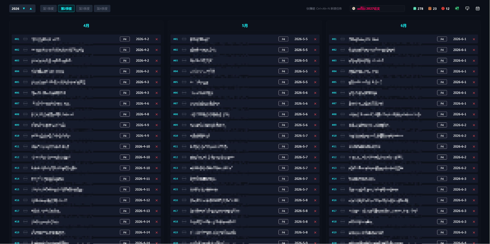

# 🌌 Cyberpunk Tech TODO List

> 这是一个基于**Flask + SQLite3**后端以及**原生HTML5/CSS3/JavaScript**前端构建的、具有强烈暗黑科技/赛博朋克视觉风格的个人高效待办事项（TODO List）管理系统。系统针对现代打工人、程序员的设计语言进行了深度视觉定制，支持多维度的任务看板与日历视图切换。




## 🌟 核心特性

1. **赛博朋克视觉风格**：深色底色搭配霓虹发光元素，打造极具沉浸感的界面。
2. **多视图切换**：支持三栏式主看板与内置中国农历、法定节假日的卡片日历视图自由切换。
3. **短期/远期目标管理**：项目支持多目标维护，远期目标在顶部，可长期显示，亦可增删改查；短期目标支持四个优先级定义。
4. **跨月/跨天校准**：历史未完成任务会自动迁移至新月份，且页面重新获得焦点时会自动校准跨天状态，无需刷新。
5. **动画**：引入FLIP动画，支持任务原生鼠标拖拽排序与新建任务时的平滑自动聚焦。
6. **快捷键**：系统自动识别运行环境，支持Windows(`Ctrl+Alt+N`)与Mac(`Cmd+Option+N`)快速新建任务。
7. **数据备份与迁移**：支持一键导出Excel备份，并支持通过Excel模板批量导入任务及完成状态。

## 🛠️ 技术栈

- **后端**：
  - Python 3.x
  - Flask (轻量级Web框架)
  - SQLite3 (嵌入式关系型数据库)
  - openpyxl (Excel读写处理)
  - chinesecalendar & zhdate (中国农历与法定节假日计算引擎)
- **前端**：
  - 原生HTML5/CSS3（自定义变量、Sticky吸顶特效、自定义Scrollbar）
  - 原生JavaScript（Vanilla JS，纯事件驱动，FLIP重排算法）


## 📂 项目结构

```text
├── app.py                 # Flask后端核心逻辑、API路由及数据库初始化
├── database/              # 数据库目录（Git自动忽略）
│   └── todo.db            # SQLite3数据库文件
├── templates/             # 视图模板目录
│   └── index.html         # 前端页面
├── static/                # 静态资源
│   └── img/               # 矢量图标库
└── requirements.txt       # Python依赖声明
```


## 🚀 快速开始

### 1. 克隆/准备项目代码
确保你的项目文件夹内包含 `app.py`、`templates/index.html` 以及相关的静态图标。

### 2. 安装依赖
在项目根目录下打开终端，运行以下命令安装所需依赖：
```bash
pip install -r requirements.txt
```

### 3. 启动服务
运行 Flask 应用程序：
```bash
python app.py
```
系统默认会在本地16001端口启动（启动端口可通过代码进行更改）。

### 4. 访问系统
打开浏览器，访问以下地址即可开启你的任务流：
```bash
http://127.0.0.1:16001
```


## ⌨️ 快捷键指南
- **Windows**：Ctrl + Alt + N，在当前月份/季度中快速新建一条待办任务并自动聚焦。
- **Mac OS**：Cmd + Option + N，在当前月份/季度中快速新建一条待办任务并自动聚焦。


## 🔒 隐私与数据安全
- **数据本地化**：所有任务、远期目标均存储在本地的database/todo.db中，绝不上传至任何第三方云端服务器，保障绝对的隐私。
- **备份建议**：建议每周点击右上角的Excel导出按钮，将数据备份至本地其他安全盘目录。

## 📄 批量导入任务操作指南
### 1. 准备标准化Excel文件
系统会自动跳过第一行表头，从第二行开始读取数据。若在Excel中为文字添加**删除线**，系统会自动将其识别为“已完成”任务。请按下方表格结构排布数据：

| 列号 | 字段       | 说明 | 示例         |
|:---|:---------| :--- |:-----------|
| A列 | 序号       | 无要求，可留空 | 1          |
| B列 | **任务名称** | 必填项，任务的具体内容 | 课题组会 14:30 |
| C列 | 日期       | 选填，格式为 `YYYY-MM-DD`，留空则自动归为“本月待定” | 2026-06-15 |

### 2. 一键上传并生效
在系统顶部控制栏右侧，点击“批量导入任务”图标（带有向内箭头的按钮），在弹出的窗口中选择准备好的 `.xlsx` 文件。系统解析完成后网页会自动刷新，数据即刻无缝追加到列表中。
